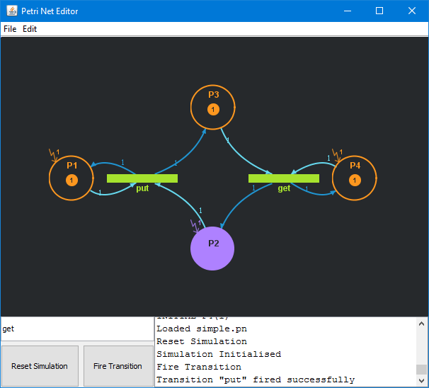
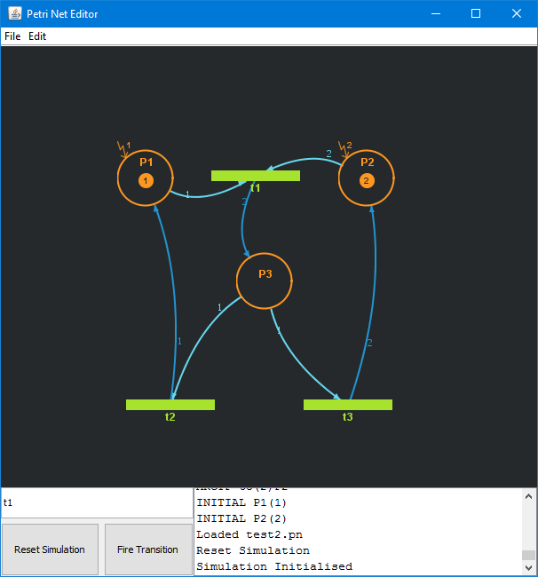

# Petri Net Editor
Petri Net Editor is a tool to create and simulate basic Place/Transition Nets.  

## Screenshots
  

## Compiling
Compile the source with `javac -jar *.java`  

## Running
Run with `java PetriNetEditor`
